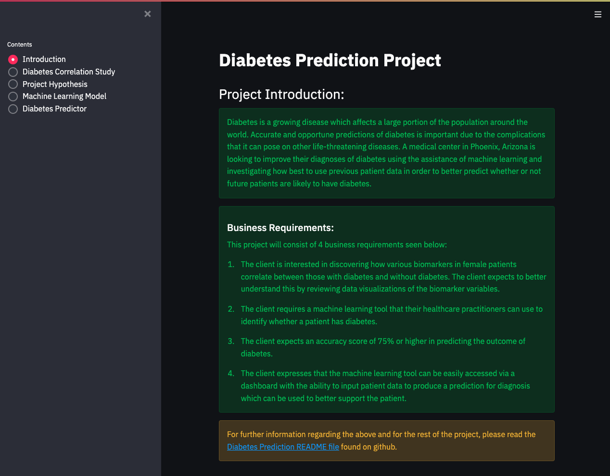

# Diabetes Prediction
The Diabetes Predictor is a Machine Learning project that assists healthcare professionals in providing a prediction on whether or not a patient has diabetes using data inputs. 

The dashboard for the Diabetes Predictor is hosted on Heroku and can be accessed [Clicking Here](https://pp5-diabetes-prediction.herokuapp.com/)

## Table of Contents
1. [Dataset Content](#dataset-content)
2. [User Stories](#user-stories)
3. [Business Requirements](#business-requirements)
4. [Hypothesis](#hypothesis)
5. [Rationale](#rationale)
6. [ML Business Case](#ml-business-case)
7. [Dashboard Design](#dashboard-design)
8. [Bug fixes](#bug-fixes)
9. [Deployment](#deployment)
10. [Libraries](#libraries)
11. [Credits](#credits)
12. [Acknowledgements](#acknowledgements)

## Dataset Content
* The dataset is sourced from [Kaggle](https://www.kaggle.com/datasets/uciml/pima-indians-diabetes-database).
* The dataset was originally from the National Institute of Diabetes and Digestive and Kidney Diseases.  
* The dataset relates to female subjects based on how many pregnancies they have been through and how various biomarkers correlate to an outcome of being diabetic. From this dataset predictive analytics can be used to assist healthcare professionals in providing a prediction on whether or not a patient has diabetes.
* The dataset consists of 768 rows and 9 feature sets which represent the following predictor variables: Pregnancies (The number of pregnancies had by the patient), Glucose (Plasma glucose concentration), Blood pressure (Diastolic blood pressure measured in mm Hg), Skin Thickness (Tricep skin fold measured in mm), Insulin levels (2-hour serum level measured in mu U/ml), BMI (Body Mass Index measured in weight Kg/height m^2), Diabetes Pedigree Function (Scores likelihood of diabetes based on family history), Age (the age of the subject) and a target variable of Outcome (indicator for whether the patient has diabetes)

|Variable|Meaning|Units|Data Type|
|:----|:----|:----|:----|
|Pregnancies|Number of times pregnant|0-17|int|
|Glucose|Plasma glucose concentration using a glucose tolerance test|0 - 199|int|
|BloodPressure|Diastolic blood pressure (mm Hg)|0 - 122|int|
|SkinThickness|Tricep skin fold thickness (mm)|0 - 99|int|
|Insulin|2-hour serum insulin (mu U/ml)|0 - 846|int|
|BMI|Body Mass Index (kg/m^2)|0 - 67.1|float|
|DiabetesPedigreeFunction|Scores likeliness of diabetes based on family history|0.08 - 2.42|float|
|Age|Age of the subject|21 - 81|int|
|Outcome|Class variable of 0(500) or 1(268)|0 - 1|int|

## Business Requirements
Diabetes is a growing disease which affects a large portion of the population around the world. Accurate and opportune predictions of diabetes is important due to the complications that it can pose on other life-threatening diseases. A medical center in Phoenix, Arizona is looking to improve their diagnoses of diabetes using the assistance of machine learning and investigating how best to use previous patient data in order to better predict whether or not future patients are likely to have diabetes.

* 1 - The client is interested in discovering how various biomarkers in female patients correlate between those with diabetes and without diabetes. The client expects to better understand this by reviewing data visualizations of the biomarker variables.
* 2 - The client requires a machine learning tool that their healthcare practitioners can use to identify whether a patient has diabetes.
* 3 - The client expects an accuracy score of 75% or higher in predicting the outcome of diabetes.
* 4 - The client expresses that the machine learning tool can be easily accessed via a dashboard with the ability to input patient data to produce a prediction for diagnosis which can be used to better support the patient.

## User Stories
The project for predicting diabetes can be divided into 4 epics which are as follows:
* The collection of the data
* Data visualisation and preparation
* Training and implementing the Machine Learning model
* Planning, Creation and deployment of the dashboard for endpoint use

The user stories which relate to the above epics can be seen below in the table along with their mapping to the Business Requirements.

|No.|As a |I want to |Business Requirement Covered |Satisfied? (Y/N)|
|:----|:----|:----|:----|:----|
|1.|Client|Be able to get a prediction on whether a patient has diabetes|Business Requirement 2|Y|
|2.|Client|Make use of a dashboard to easily input figures and have a resulting outcome|Business Requirement 4|Y|
|3.|Client|See visualisation of data variables to make it easier to interpret|Business Requirement 1|Y|
|4.|Client|See how biomarkers correlate to the likeliness of diabetes|Business Requirement 1|Y|
|5.|Client|Have a brief summary of what each data column means for understanding data values|Business Requirement 1, 4|Y|
|6.|Client|Have a summary of the analysed data for better understanding|Business Requirement 4|Y|
|7.|Client|Have access to a live website to easily access the dashboard at any time|Business Requirement 4|Y|
|8.|Client|Understand the content of the data and where it is sourced|Business Requirement 1|Y|
|9.|Client|See if the data was prepared in any way for modeling for better insight to the process|Business Requirement 1, 2|Y|
|10.|Client|See what the ratio used for the training of the machine learning model to better understand the tuning of the model|Business Requirement 2, 3|Y|
|11.|Client|Have an accuracy score of 75% or greater with prediction whether or not a patient has diabetes|Business Requirement 3|Y|
|12.|Data Practitioner|Have a relevant dataset in order to conduct analysis and create a ML model|Business Requirement 1|Y|
|13.|Data Practitioner|Be able to make predictions off of the dataset following the creation of a ML model|Business Requirement 2, 4|Y|
|14.|Data Practitioner|Be able to clean the dataset of any unusable or incomplete data for use with analysis and the machine learning model|Business Requirement 1|Y|
|15.|Data Practitioner|Create a machine learning model for predicting the likeliness of diabetes|Business Requirement 2|Y|
|16.|Data Practitioner|Plan and create a dashboard to visualise the data and enable the end user to make use of future predictions|Business Requirement 4|Y|
|17.|Data Practitioner|Have a live website where new dashboard implementations can be developed|Business Requirement 4|Y|

## Hypothesis and Validation
The following hypothesis will help guide the direction of data analysis for the above dataset.
* Based off of my understanding of diabetes, High blood sugar levels are likely to be a primary predictor of the outcome of a diabetes diagnosis.
    * Visualisation to be used and correlation study to validate
    * This hypothesis was determined to be True where Blood sugar levels had the largest impact on the outcome of a diabetes diagnosis
* I predict that Age will have an affect on the correlation of diabetes
    * Visualisation to be used and correlation study to validate
    * This hypothesis was determined to be True, Age played a large role in determining whether or not the patient was likely to have diabetes
* I also predict that BMI may hold some weight in the prediction of diabetes
    * Visualisation to be used and correlation study to validate
    * Whilst not as important as the above to variables BMI had an impactful outcome on whether a patient was diabetic or not so therefor the hypothesis was determined to be True
* Biomarkers such as blood pressure and skin thickness will likely hold a low level of correlation for whether or not a patient has diabetes.
    * Visualisation to be used and correlation study to validate
    * The hypothesis was determined to be True based on the data analysis
* Due to the dataset being fairly small in size and splitting the data between train and test, may pose difficulties in achieving a high accuracy score.
    * Experiment with Train/Test split ratios or potential use of other ML models to achieve a better score.
    * The outcome of training the model resulted in a well-performing accuracy score that met the business requirements. Which one could argue, made the hypothesis false however, due to the small dataset size it would be difficult to improve this score further.

## Rationale to map the business requirements to the Data Visualisations and ML tasks
* Business Requirement 1 - Correlation and Visualisation of Data
    * Inspect the data relating to the variables in the diabetes dataset
    * Standardisation of data required to analyse due to 0 values on some variables which hold no worth
    * Make use of a Correlation Study to help understand which variables are linked to the outcome of diabetes
    * Visualisations and the correlation study will be used to support the validation
    * The Correlation Study and Feature Engineering notebooks detail these business requirements.
* Business Requirement 2 - Build a Machine Learning model
    * Split data into two categories, training data and testing data.
    * Be able to make predictions of the likeliness of diabetes
    * Make use of a Support Vector Machine model to classify whether or not a patient is diabetic for use in the medical industry.
    * The Feature Engineering and Modeling Evaluation notebooks cover these business requirements.
* Business Requirement 3 - Accuracy of ML tool
    * Having trained the model, testing data will be used to determine the accuracy score for insight into how well the model is performing.
    * The Modeling Evaluation notebook details this business requirement.
* Business Requirement 4 - Creation of a Dashboard for user input
    * Creation of a user interface where a summarised description of model and data visualisations can be viewed
    * Allow for manual data input for the model to predict diabetes outcome
    * The streamlit app pages cover this business requirement.

## ML Business Case
* A Machine Learning model is required to predict the outcome of a patient having diabetes or not.
* Creation of a Machine Learning Model which satisfies the business requirement of predicting at a score of 0.75 or greater on both the training and test datasets. It will be able to make appropriate predictions on test data and any future data used by the client.
* A Support Vector Machine model will be chosen to achieve the prediction due to it being a classifier model and can therefor classify whether or not a patient is diabetic or non-diabetic.
* If the model is unable to reach an accuracy score of 0.75 then this will be deemed a fail anything greater than this would be a success.
* The output of the model will be defined as whether the patient is given a prediction of diabetic or non-diabetic.
* The dataset used for the training of the model is derived from a publicly available dataset on Kaggle, containing 768 rows and 9 feature sets. The target variable for the trainset is the 'Outcome' variable with 0 meaning non-diabetic and 1 meaning diabetic. As this is publicly available there are no ethical or privacy concerns.
* By creating a Machine Learning model to predict the outcome of patients having diabetes it will improve the efficiency of healthcare workers and the medical industry's ability to diagnose patients allowing resources to be used elsewhere.
* Having a dashboard endpoint will allow for healthcare workers to easily input data to achieve a prediction on patient data.

## Dashboard Design
Below are the following pages detailed for the Streamlit App User Interface which consist of 5 pages:

* Page 1 - Introduction
* Page 2 - Correlation Study
* Page 3 - Hypothesis
* Page 4 - Machine Learning Model
* Page 5 - Diabetes Prediction

##### Page 1: Introduction
* This page summarises the business case
* Details the business requirements
* Displays Dataset information and explanations for the feature sets in a table format

##### Page 2: Correlation Study
* This page shows the correlation study for the diabetes outcome from the notebook 02-CorrelationStudy.ipynb
* This page is intended to answer the business requirement 1 for the Correlation and Visualisation of data.
* Post-Data analysis determined that the page will contain:
    * The business requirement - Correlation and Visualisation of Data
    * A Checkbox for the inspection of data involving the number of rows and columns of the dataset
    * Visualisation of the correlated variables in form of heatmap
    * Checkbox for the Visualisation of individual plots for the feature sets
    * Written conclusion for the correlated variables

##### Page 3: Hypothesis
* This page will cover the project hypotheses posed at the start of the project
* This page partly covers the business requirement 1 for discovering how biomarkers correlate with the outcome of diabetes
* Post data analysis the page determined the confirmation of the following hypotheses:
    * *Based off of my understanding of diabetes, High blood sugar levels are likely to be a primary predictor of the outcome of a diabetes diagnosis.*
    * *I predict that Age will have an affect on the correlation of diabetes*
    * *Biomarkers such as blood pressure and skin thickness will likely hold a low level of correlation for whether or not a patient has diabetes.*

##### Page 4: Machine Learning Model
* This page will display the Machine Learning Model for the Data Practitioner
* This page will cover business requirement 2 for building a machine learning model
* This page will also cover business requirement 3 for the accuracy of the machine learning model
* The feature set used to fit the model and feature importance will be displayed
* The performance of the machine learning model will be displayed by showing the accuracy score for both the train and test datasets
* Confirmation of whether the data meets the business requirement of having a 75% or above accuracy

##### Page 5: Diabetes Outcome Prediction
* This page is intended to cover the business requirement 4 for having an interactive dashboard where the user can input data to form a prediction for the outcome of diabetes
* This page will contain numerous interactive input widgets such as number input widgets for data entry
* An interactive button widget for the user to press to input the diabetes dataset to the machine learning pipeline for predicting the outcome of diabetes
* The page will display a generated message as a result of pressing the button widget informing the user of the predicted outcome of Diabetic or Non-Diabetic

## Bug Fixes
|**Bug**|**Fix**|
|:----|:----|
|Visualisations wouldn't display when running cells.|Used `%matplotlib inline` to make output appear and be stored within the notebook.|
|ModuleNotFoundError: No module named 'ipywidgets' when trying to load `pandas_profiling ProfileReport`.|Fix was found on [stackoverflow](https://stackoverflow.com/questions/34364681/no-module-named-ipywidgets-error-when-running-ipyhon-widgets) where it was the case of needing to do a pip install of ipywidgets before running the ProfileReport.|
|AttributeError: ‘numpy.ndarray’ object has no attribute ‘to_csv’ when trying to push test/train .csv file to the repo|Fixed by converting to a pandas dataframe using the following code `pd.DataFrame(x_train).to_csv("outputs/datasets/cleaned/x_train_cleaned.csv", index=False)`|
|Deployment to Heroku Failed "Requested runtime 'python-3.8.15' is not available for this stack (heroku-22)."|Installed heroku CLI and used the following command to set the stack to Heroku-20 `heroku stack:set heroku-20`|
|/workspace/.pip-modules/lib/python3.8/site-packages/sklearn/utils/validation.py:63: DataConversionWarning: A column-vector y was passed when a 1d array was expected. Please change the shape of y to (n_samples, ), for example using ravel(). return f(*args, **kwargs) SVC(kernel='linear')|Fix was found on [stackoverflow](https://stackoverflow.com/questions/34165731/a-column-vector-y-was-passed-when-a-1d-array-was-expected) added `.values.ravel()` to y_train for SVC classifier|
|OSError: Cannot save file into a non-existent directory: '{file_path}'|This was due to a typo where the 'f' was left off at the start to make it a formatted string literal|

## Deployment

### Gitpod
* The site and app was built in Gitpod with the dashboard being built with streamlit.
* The site was then later deployed to Heroku for hosting.
* The app.py file contains the code used to run the site.
* Previewing of development was carried out continuously throughout using the streamlit run app.py command.
* The Code Institute template for Heritage Housing Issues was forked and used for this project.

### Heroku
* The App live link is: https://pp5-diabetes-prediction.herokuapp.com/ 
* The project was deployed to Heroku using the following steps.

1. Log in to Heroku and create an App
2. At the Deploy tab, select GitHub as the deployment method.
3. Select your repository name and click Search. Once it is found, click Connect.
4. Select the branch you want to deploy, then click Deploy Branch.
5. Make sure that the python version used in runtime.tct is compatible with the Heroku stack used for the app.
5. Click the button Open App on the top of the page to access your App.

## Libraries
Various Libraries were used in the project for creating a ML model to predict the outcome of diabetes. These libraries can be seen below and the versions are also found in the requirements.txt file within the repository. 
* Streamlit - used to create a dashboard and interactive UI for predicting diabetes outcome
* Pandas - used to convert CSV data into a Pandas DataFrame for manipulation and data management
* pandas_profiling - used to inspect the datasets features to understand the data for cleaning and visualisation
* Numpy - used to generate an array of figures for the feature sets which was then used for correlation and visualisations
* Scikit-learn - used to train and evaluate the Machine Learning model for predicting diabetes outcome
* Seaborn - used for creating the data visualisations such as plot graphs, violin plots and heatmaps
* MatPlotLib - used for creating data visualisations for the plots
* Jupyter - used as the environment for creating notebooks to collect, inspect, clean and visualise the data as well as for the creation of the ML model
* Custom Support Vector Machine Model was created and used for the ML Model found in the svm_model.py file

## Credits 
* Code Institutes template for ['Heritage Housing Issues'](https://github.com/Code-Institute-Solutions/milestone-project-heritage-housing-issues) was used to build off of.
* Guidance for how to approach the project taken from Code Institutes 'Churnometer' project walkthrough, specifically the Data cleaning notebook section.
* Code Institutes Feature Engine Unit 9: Custom Functions was used and modified for requirements for quick feature engineering code in notebook 03-FeatureEngineering.ipynb
* Increasing understanding using Udemy learning course on ['Learning Python for Data Analysis and Visualization'](https://www.udemy.com/course/learning-python-for-data-analysis-and-visualization/) by Jose Portilla
* Increasing understanding using Udemy learning course on ['Python for Data Science and Machine Learning Bootcamp'](https://www.udemy.com/course/python-for-data-science-and-machine-learning-bootcamp/) by Jose Portilla where aditional learning took place for Support Vector Machines
* Coursera learning course on ['Build a Machine Learning Web App with Streamlit and Python'](https://www.coursera.org/projects/machine-learning-streamlit-python)
* A Library of Youtube tutorials and learning material used for additional guidance with the project, offered by [Siddhardhan](https://www.youtube.com/@Siddhardhan/videos) which inspired the idea of using a Support Vector Machine model to classify the data. The [tutorial](https://www.youtube.com/watch?v=xUE7SjVx9bQ) on a diabetes prediction project using machine learning was very helpful as well as [how to create a SVM model](https://youtu.be/WdXapAG6TYo).
* National Library of Medicine Article on ['Predicting Type 2 Diabetes Using Logistic regression and Machine Learning Approaches'](https://www.ncbi.nlm.nih.gov/pmc/articles/PMC9018179/) was used to gain an understanding for potential approaches which could be used for the project.
* Markdown cheatsheet from [Adam Pritchard](https://github.com/adam-p/markdown-here/wiki/Markdown-Cheatsheet) was referred to as a refresher and ease of reference for the different commands that can be used.
* Stackoverflow for fixing an issue where [No module named 'ipywidgets'](https://stackoverflow.com/questions/34364681/no-module-named-ipywidgets-error-when-running-ipyhon-widgets)
* Resource used for learning about [%matplotlib inline](https://pythonguides.com/what-is-matplotlib-inline/)
* Inspiration was taken from a [Kaggle Notebook](https://www.kaggle.com/code/sztuanakurun/diabetes-classification-data-visualization) for the order of importance and external code was modified to suit the needs of the Correlation study.
* External code sourced from [towardsdatascience](https://towardsdatascience.com/pima-indian-diabetes-prediction-7573698bd5fe) and was modified to be appropriate for dataset with imputing zero value data.
* stackoverflow answer for a bug fix converting a numpy array to a pandas dataframe relating to an issue i had with [AttributeError: 'numpy.ndarray' object has no attribute 'to_csv'](https://stackoverflow.com/questions/56600918/how-do-numpy-ndarray-object-do-not-numpy-ndarray-object)
* Stackoverflow answer for [Retaining column headers after scikit-learn](https://stackoverflow.com/questions/29586323/how-to-retain-column-headers-of-data-frame-after-pre-processing-in-scikit-learn)
* Streamlit [cheatsheet](https://docs.streamlit.io/library/cheatsheet) used for reference with creation of streamlit app pages.
* Resource used for help with [Creating a HTML table](https://discuss.streamlit.io/t/how-to-render-already-prepared-html-code-with-streamlit/3387/2) in streamlit.

## Acknowledgements
* My mentor Mo Shami as always for his words of support, time, and help.
* Niel_ci for his quick response and help with an issue I had.
